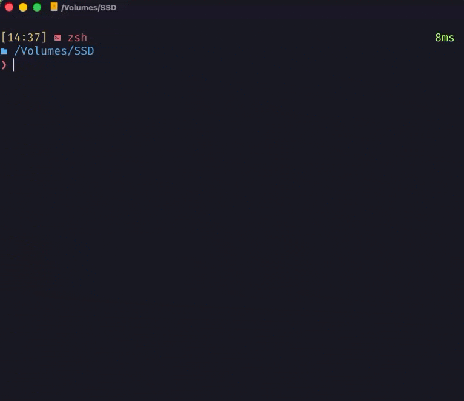

# Adb-Sync-Tool

Seamlessly syncs directories between your Mac/Linux machine and Android.

## Introduction

Similar to projects such as [adb-sync](https://github.com/google/adb-sync) and [better-adb-sync](https://github.com/jb2170/better-adb-sync), adb-sync-tool's goal is to sync between a local directory and an android device directory using adb. Unlike the other projects, adb-sync-tool is designed for directories that will need to be synced frequently, by employing a config file and an alias rather than ad-hoc `local` and `remote` arguments.

See it in action:



## Speed comparisons
The following were implemented on an M4 Max Mac Studio and a Oneplus 11. The data comes from ten samples of 961 txt files coming from entries 1-1000 in [Project Gutenberg's library](https://www.gutenberg.org/ebooks/offline_catalogs.html).
| Stream Direction | Better-ADB-Sync (seconds) | Adb-Sync-Tool (seconds) | % Improvement |
| -----------------|---------------|---------------|----------------|
| Push | 116.21 ± 2.08 | 88.67 ± 3.96 | 31.1%  |
| Pull | 63.38 ± 1.94 | 36.48 ± 1.95 | 73.7% |

## Installation and usage instructions

0. Make sure that android-debug-bridge (adb) is installed and developer options are turned on.
   - To install adb, please look up instructions based on your distribution.
     1. For mac homebrew:
     ```
        brew install --cask android-platform-tools
     ```
     2. For Arch Linux users:
      ```
         sudo pacman -S android-tools
      ```
   - To turn on developer mode, [follow these instructions](https://developer.android.com/studio/debug/dev-options#enable).

2. Clone the repository to your home directory:

```
cd ~ && git clone https://github.com/soundsflyout/adb-sync-tool/
```

*Note: the repository must be in the home directory for the program to read the
config file properly.*

2. If rust is not installed on your system:

```
curl --proto '=https' --tlsv1.2 -sSf https://sh.rustup.rs | sh
```

3. Install with cargo.
```
cd ~/adb-sync-tool && cargo install --path .
```

4. Create a `config.json` file in `~/adb-sync-tool/` and follow the format
   in `example_config.json`. See the next section for more info.
   
5. To run the program, plug in your android device via usb and run:
- `ast push {YOUR_ALIAS}` to sync files from your local machine to the android device.
- `ast pull {YOUR_ALIAS}` to sync files from your android device to your local machine.
See `ast --help` for additional options. 

## Getting the android device storage location for config.json
### If you are syncing the directory from your android device's internal storage
You just need to prepend '/sdcard/' to the 'remote_dir' value. For example, if you wanted to sync my `Music` directory in internal storage,
you would set in `config.json`:
```
{
   "music": {
      "local_dir": "/local/path/to/my/music",
      "remote_dir": "/sdcard/Music/",
      "allow_hidden": false
   }
}
```
Running `ast push music` will then push my music into the `Music` directory in internal storage. 

### If you are syncing the directory from your android device's SD card
You need to get the SD card name. Run `ast storage` to print out the names of all the mount points on your android device. The SD card will usually
be mounted on `/storage/{YOUR SD CARD NAME}`. E.g. my SD card has the name `/storage/BF87-2316/`. It will *not* be 
`/storage/emulated`. We can repeat the same steps as in the internal storage case. For example, `config.json` would be:
```
{
   "music": {
      "local_dir": "/local/path/to/my/music",
      "remote_dir": "/storage/{NAME OF YOUR SD CARD}/Music/",
      "allow_hidden": false
   }
}
```
to configure sync for the `Music` folder in the SD card. 

## Features to be added
- Add a `--delete` flag to delete files in target directory that does not
belong in source directory.
- Properly handle admin permissions (current plan is to ignore
files/directories where the user does not have permissions).

## Considerations to be aware of
- If a local directory has a trailing whitespace, such as 'hello /', the program will
  exit. This is because android will auto remove trailing whitespaces when making
  directories: i.e., android will make `hello/` when asked to make `hello /`
- If a directory does not have permissions to be written to, the program will
exit.

## Known issues

